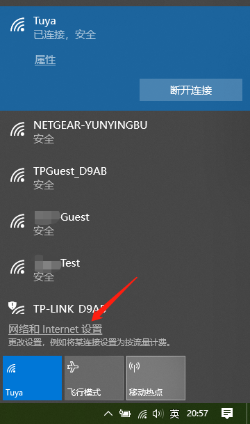
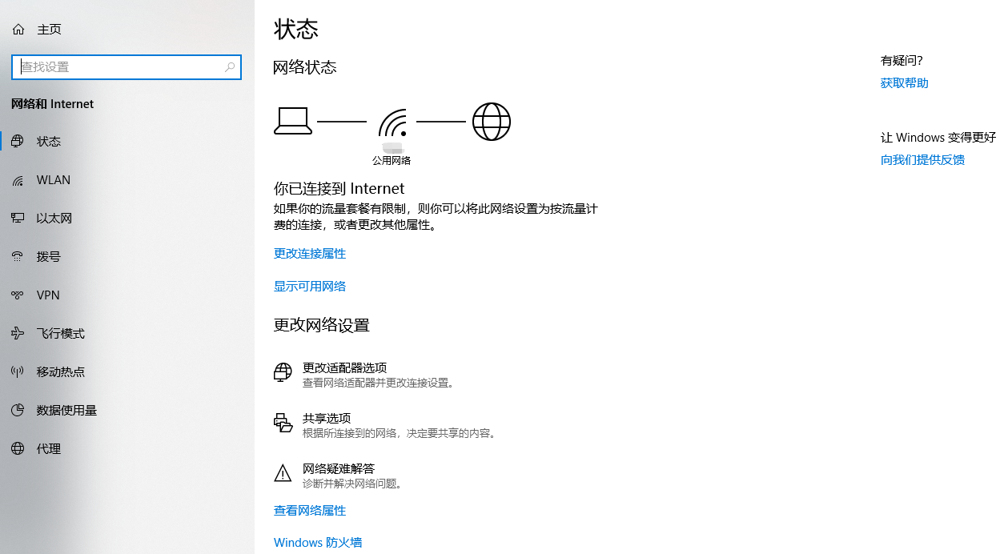
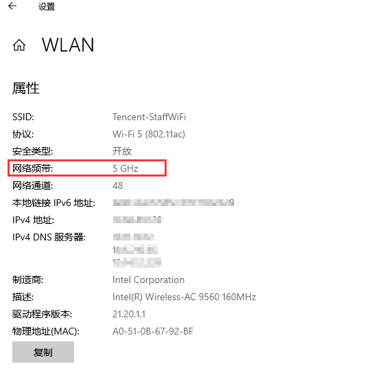

## 概述
为进一步构建物联网开放生态，由腾讯云物联网平台打造的腾讯连连 App SDK，集成通用版 App 的多功能模块。设备厂商可通过 SDK 将设备接入腾讯云物联网平台进行设备管理，涵盖安防告警、家用电器、运动健康、网络设备等众多设备。

## Android 接入流程

1、在 App module下的build.gradle中添加依赖项

```
implementation 'com.tencent.iot.explorer:explorer-link-android:x.x.x'
```
具体版本号可参考 [explorer-link-android](https://cloud.tencent.com/document/product/1081/47787)


## SDK接口说明

设备相关
--------

注册相关的api在`IoTAuth.registerImpl`中，每个传入callback的api都会有和api名字对应的reqCode，如发送手机验证码api：IoTAuth.registerImpl.sendPhoneCode对应的reqCode为：RequestCode.send_phone_code。

#### 手机号码注册

第一步：获取手机验证码

```IoTAuth.registerImpl.sendPhoneCode(phone, callback)```

第二步：校验手机验证码

```IoTAuth.registerImpl.checkPhoneCode(countryCode, phone, code, callback)```

第三步：提交注册

```IoTAuth.registerImpl.registerPhone(countryCode, account, code, pwd, callback)```

请求返回处理：
```
private val callback = object : MyCallback {
    override fun fail(msg: String?, reqCode: Int) {  }

    override fun success(response: BaseResponse, reqCode: Int) {
        when(reqCode){
            RequestCode.send_phone_code->{}
            RequestCode.check_phone_code->{}
            RequestCode.phone_register->{
                if (response.isSuccess()){
                    //请求成功
                } else { }
            }
        }
    }
}
```

#### 邮箱帐号注册

邮箱注册与手机号注册步骤一样，相关api如下：
```
IoTAuth.registerImpl.sendEmailCode(account, callback)
IoTAuth.registerImpl.checkEmailCode(account, code, callback)
IoTAuth.registerImpl.registerEmail(account, code, pwd, callback)
```

#### 帐号登录

登录方式有三种：手机号、邮箱、微信授权登录，以下相关API使用IoTAuth.loginImpl
调起：

```fun loginPhone(countryCode: String, phone: String, pwd: String, callback:LoginCallback)```

```fun loginEmail(email: String, pwd: String, callback: LoginCallback)```

```fun wechatLogin(code: String, callback: LoginCallback)```

登录回调LoginCallback成功回调返回的user中包含用户登录信息：登录过期时间ExpireAt、登录口令Token:
```
interface LoginCallback {
    fun success(user: User)
    fun fail(msg: String)
}
```

关于SDK登录过期，SDK内部有过期处理机制，可以在Application中注册登录过期监听回调：

```
IoTAuth.addLoginExpiredListener(object : LoginExpiredListener {
    override fun expired(user: User) {
        Log.e("TAG", "用户登录过期")
    }
})
```

### 个人信息

查询个人信息详情：

```IoTAuth.userImpl.userInfo(callback)```

修改用户昵称：

```IoTAuth.userImpl.modifyAlias(nick, callback)```

修改用户头像：

```IoTAuth.userImpl.modifyPortrait(url, callback)```

绑定手机号：发送验证码、校验、绑定。

```
IoTAuth.userImpl.sendBindPhoneCode(countryCode, account, callback)
IoTAuth.userImpl.checkBindPhoneCode(countryCode, account, code, callback)
IoTAuth.userImpl.bindPhone(countryCode, account, code, callback)
```

### 意见反馈

可以提交文字、图片链接和联系方式

```IoTAuth.userImpl.feedback(advise: String, phone: String, picUrl: String, callback: MyCallback)```

### 密码服务

使用旧密码更新密码：

```IoTAuth.passwordImpl.resetPassword(oldPwd, newPwd, callback)```

通过手机号验证重置：发送验证码、校验、设置密码。

```
IoTAuth.passwordImpl.sendPhoneCode(countryCode,phone, callback)
IoTAuth.passwordImpl.checkPhoneCode(countryCode,phone, code, callback)
IoTAuth.passwordImpl.resetPhonePassword(countryCode, phone, code, pwd, callback)
```

通过邮箱验证重置：发送验证码、校验、设置密码。
```
IoTAuth.passwordImpl.sendEmailCode(email, callback)
IoTAuth.passwordImpl.checkEmailCode(email, code, callback)
IoTAuth.passwordImpl.resetEmailPassword(email, code, pwd, callback)
```

设备相关
--------

### 设备配网

创建service对象，task是LinkTask，主要保存wifi信息

```
class LinkTask {
    var mSsid: String = "" //wifi名
    var mBssid: String = "" //mac地址 SoftAP时不用给
    var mPassword: String = "" //wifi密码
    ...
}
```

#### 智能配网（SmartConfig）

步骤：
* 打开设备进入SmartConfig配网模式
* 获取配网wifi信息
* 创建LinkTask
* 创建SmartConfigService
* 添加监听SmartConfigListener
* smartConfigService?.startConnect(task, smartConfigListener)
* 获取设备签名
* 绑定设备。

注：如果界面需要展示配网进度，可以根据监听返回的步骤决定进度值。可参考官网 [SmartConfig 配网开发](https://cloud.tencent.com/document/product/1081/48405) 了解详细数据交互流程。

```
val service = SmartConfigService(this)
service.listener = object : SmartConfigListener {

    override fun onSuccess(deviceInfo: DeviceInfo) {
        //获取签名成功,开始绑定设备
    }
    override fun deviceConnectToWifi(result: IEsptouchResult) {
        //配网开始后，设备联网成功，后台开始获取签名
    }
    override fun onStep(step: SmartConfigStep) {
        //配网步骤回调
    }
    override fun deviceConnectToWifiFail() {
        //设备联网失败
    }
    override fun onFail(exception: TCLinkException) {
        //配网失败
    }
}
smartConfigService?.startConnect(task, smartConfigListener)
```

#### 自助配网（SoftAP）

步骤:
* 打开设备进入SoftAP配网模式
* 获取配网wifi信息
* 创建LinkTask
* 手机连接设备热点
* 创建SoftAPService
* 添加监听SoftAPListener
* softAPService?.startConnect(task, softAPListener)
* 获取设备签名
* 手机重新联网
* 绑定设备。

可参考官网 [softAP 配网开发](https://cloud.tencent.com/document/product/1081/48404) 了解详细数据交互流程。

```
val service = SoftAPService(this)
service.listener = object : SoftAPListener {
    override fun onSuccess(deviceInfo: DeviceInfo) {
        //获取签名成功,与热点断开并尝试连接网络
    }
    override fun reconnectedSuccess(deviceInfo: DeviceInfo) {
        //重连成功
    }
    override fun reconnectedFail(deviceInfo: DeviceInfo, ssid: String) {
        //重连失败
    }
    override fun onStep(step: SoftAPStep) {
        //配网步骤回调
    }
    override fun onFail(code: String, msg: String) {
        //配网失败
    }
}
softAPService?.startConnect(task, softAPListener)
```

重连网络后请求不一定能成功，为保证设备绑定成功，需要尝试多次发起绑定请求，最大程序保证请求发送成功：

```
override fun reconnectedFail(deviceInfo: DeviceInfo, ssid: String) {
    Reconnect.instance.start(connectionListener)
}
```

在绑定请求发送成功响应后，无论绑定成功还是失败，都要取消，否则请求会一直发送
```
//取消网络请求重发监听
retryJob.stop()
```

### 设备绑定

配网设备绑定：

```
IoTAuth.deviceImpl.wifiBindDevice(UserID, bindDeviceToken, FamilyId, data, object: MyCallback {
    override fun fail(msg: String?, reqCode: Int) {
        //请求发送失败
    }
    override fun success(response: BaseResponse, reqCode: Int) {
        if (response.isSuccess())｛//绑定成功｝
        else｛//绑定失败｝
        //取消网络请求重发监听
        retryJob.stop()
    }
})
```

扫码设备绑定：

```IoTAuth.deviceImpl.scanBindDevice(familyId: String, signature: String, callback:MyCallback)```

### 设备控制

控制设备，其中data是控制数据json字符串，如:{"light_switch":0}

```
IoTAuth.deviceImpl.controlDevice(productId: String, deviceName: String, data:
String, callback: MyCallback)
```

获取设备控制面板的数据，物联网平台为设备提供了三种不同风格的面板控制：简约simple、标准standard、暗黑dark.获取面板数据有两种：

直接获取，此方式只支持单个产品设备获取：
```
IoTAuth.deviceImpl.controlPanel(productId: String, deviceName: String, callback:
ControlPanelCallback)
```

自定义获取，分别获取设备对应产品的物模型数据、产品的界面配置、设备当前各项属性值。

物模型数据（属性类型、名称、取值范围等）：

```
IoTAuth.deviceImpl.controlPanel(productIds:ArrayList<String>, callback:MyCallback)
```

界面配置（每个属性的按钮大、中、小、长）:
```
IoTAuth.deviceImpl.deviceProducts(productIds: ArrayList<String>, callback:MyCallback)
```
设备当前各项属性值(开关状态、亮度、温度等)：
```
IoTAuth.deviceImpl.deviceData(productId: String, deviceName: String, callback:MyCallback)
```

### 设备管理

添加设备监听，用于监听物联网平台下发的数据变化，可以重复调用。
```
/**
 * 注册监听
 * @param deviceIds 多个设备的deviceId
 * @param callback MessageCallback注册监听请求回调，可为null
 */
IoTAuth.registerActivePush(deviceIds: ArrayString, callback: MessageCallback?)
```

以上步骤是为SDK注册的，想要在app内得到下发数据还需要在需要的地方添加监听器：[ActivePushCallback](#activepushcallback)，详情在请看
相关Callback介绍。
```
/**
 * 添加监听器
 * @param callback ActivePushCallback，设备数据推送到客户端的回调。在调用registerActivePush成功后，添加有监听器的页面可以收到推送数据，最多30个监听器，超出时会移除最先添加的监听器，即先进先出（FIFO）
 */
IoTAuth.addActivePushCallback(callback: ActivePushCallback)
```

移除监听器：
```
IoTAuth.removeActivePushCallback(callback: ActivePushCallback)
IoTAuth.removeAllActivePushCallback()
```

另外IoTAuth.deviceImpl中还有修改设备名称、获取设备详情、设备在线状态、设备更换房间、删除设备等api，具体参考demo使用。

### 设备列表

直接获取设备列表，返回的设备列表无设备在线状态，offset和limit分页相关参数，offset为起始位置，limit为当次请求返回的列表长度，不传入limit默认返回20。
```
IoTAuth.deviceImpl.deviceList(familyId: String, roomId: String, offset: Int, callback: MyCallback)
IoTAuth.deviceImpl.deviceList(familyId: String, roomId: String, offset: Int, limit: Int, callback: MyCallback)
```

以下方式返回设备列表List<Device>并且会同步设备在线状态，同样支持分页，[DeviceCallback](#devicecallback)详情请看相关Callback介绍。
```
IoTAuth.deviceImpl.deviceList(familyId: String, roomId: String, offset: Int, callback: DeviceCallback)
IoTAuth.deviceImpl.deviceList(familyId: String, roomId: String, offset: Int, limit: Int, callback: DeviceCallback)
```

### 设备分享

通过手机号或者邮箱查询用户id，以下接口返回用户信息。
```
IoTAuth.userImpl.findPhoneUser(phone: String, countryCode: String, callback:MyCallback)
IoTAuth.userImpl.findEmailUser(email: String, callback: MyCallback)
```

发送设备分享
```
IoTAuth.shareImpl.sendShareDevice(productId: String,deviceName: String, userId: String,callback: MyCallback)
```

调用绑定共享设备api来同意设备分享
```
IoTAuth.shareImpl.bindShareDevice(productId: String, deviceName: String, deviceToken: String, callback: MyCallback)
```

查询自己当前设备已经分享的用户列表
```
IoTAuth.shareImpl.shareUserList (productId: String, deviceName: String, offset: Int, callback: MyCallback)
```

查询自己已经接受共享的设备列表

```
IoTAuth.shareImpl.shareDeviceList(offset: Int, callback: MyCallback)
```
IoTAuth.shareImpl中还有删除分享用户、删除共享设备，详情可参考demo

云端定时
--------

云端定时api请使用 IoTAuth.timingImpl

通用参数说明：
* days: 定时器开启时间，每一位——0:关闭,1:开启,从左至右依次表示: 周日 周一 周二 周三 周四 周五 周六 1000000
* repeat: 是否循环，0表示不需要，1表示需要
* timePoint: 定时时间，格式：12:00或者16：01
* Data: 是设备动作json字符串，如:{"brightness": 25, "color": 1}。

创建定时任务：
```
createTimer(productId: String, deviceName: String, timerName: String, days:String, timePoint: String, repeat: Int, data: String, callback: MyCallback)
```

定时列表：
```
timeList(productId: String, deviceName: String, offset: Int, callback:MyCallback)
timeList(productId: String,deviceName: String,offset: Int,limit: Int,callback:MyCallback)
```

开关定时任务，status: 0 关闭，1 开启
```
modifyTimerStatus(productId: String, deviceName: String, timerId: String, status: Int, callback:MyCallback)
```

修改定时任务：
```
modifyTimer(productId: String, deviceName: String, timerName: String, timerId:String, days: String, timePoint: String, repeat: Int, data: String, callback: MyCallback)
```

删除定时：
```
deleteTimer(productId: String, deviceName: String, timerId: String, callback:MyCallback)
```

家庭管理
--------

### 家庭

`IoTAuth.familyImpl`：增加家庭、修改家庭、删除家庭、家庭详情、查询家庭列表，查询家庭成员列表和家庭房间列表。

### 房间

`IoTAuth.roomImpl`：增加房间、修改房间名、删除房间。

### 家庭成员

`IoTAuth.memberImpl`：邀请家庭成员流程也是先查询用户id，然后发送邀请。所有者在这里可以移除普通家庭成员，普通家庭成员可以主动退出家庭，调用joinFamily可以接受邀请加入家庭。

消息管理
--------

SDK支持与信鸽推送绑定，在集成信鸽推送后调用api绑定，退出时解绑

```
/**
 * 绑定信鸽
 */
IoTAuth.messageImpl.bindXG(xgToken: String, callback: MyCallback)
```

```
/**
 * 解除绑定信鸽
 */
IoTAuth.messageImpl.unbindXG(xgToken: String, callback: MyCallback)
```

```
/**
 * 获取消息列表
 * @param category：消息主类型，1设备，2家庭，3通知
 * @param msgId: 消息Id，首次可不传，
 * @param timestamp: 消息的时间戳，首次可不传或传0
 * @param callback: 消息列表回调
 */
fun messageList(category: Int, msgId: String, timestamp: Long, callback: MyCallback)
```

相关Callback介绍
----------------

### MyCallback

接口成功时执行success()，response.isSuccess()可以判断响应是成功或失败，response.parse()可以解析json，解析工具是fastjson
```
interface MyCallback {
    fun fail(msg: String?, reqCode: Int)
    fun success(response: BaseResponse, reqCode: Int)
}
```

### LoginCallback

LoginCallback是登录回调，user是用户登录成功后返回信息，可以通过IoTAuth.user访问
```
interface LoginCallback {
    fun success(user: User)
    fun fail(msg: String)
}
```

### ControlPanelCallback

获取一个设备控制面板回调，成功时首先回调success(panelist:List<ControlPanel>),panelList是设备每个控制属性对应的面板类型集合，该集合也可以通过IoTAuth.deviceImpl.panelList()得到引用，另外IoTAuth.deviceImpl.panelConfig()返回产品界面配置和IoTAuth.deviceImpl.product()设备物模型

注意：只有调用了IoTAuth.deviceImpl.controlPanel(productId: String, deviceName: String, callback: ControlPanelCallback) 这3个api才会有数据。panelConfig中包含有面板主题风格的数据。当回调refresh()时说明panelList集合中的属性值获取成功，有更新。
```
interface ControlPanelCallback {
    //请求成功
    fun success(panelList: List<ControlPanel>)
    //数据刷新
    fun refresh()
    //请求失败
    fun fail(msg: String)
}
```

### DeviceCallback

只有调用了IoTAuth.deviceImpl.deviceList( familyId: String, roomId: String, offset: Int, callback:DeviceCallback)接口，IoTAuth.deviceList这个列表中才会有数据，否则只是长度为0的列表。

请求成功回调`success(deviceList:List<Device>)`
获取到列表中的设备在线状态时回调`onlineUpdate()`

注意：success(deviceList:List<Device>)中的deviceList与IoTAuth.deviceList不是同一个对象，每次调用了
```
IoTAuth.deviceImpl.deviceList(familyId: String, roomId: String, offset: Int, callback:DeviceCallback)
```
这个方法得到的设备列表都会全部添加到IoTAuth.deviceList列表中，所以刷新设备列表时记得清空，以免造成列表数据重复。
```
/**
 * 设备列表callback
 */
interface DeviceCallback {
    //请求成功
    fun success(deviceList: List<Device>)
    //在线状态获取成功
    fun onlineUpdate()
    //请求失败*
    fun fail(message: String)
}
```

### ActivePushCallback

SDK内部会将接收到的下发数据解析到payload，payload中json为原数据，payload为原数据中Payload转码后（base64）的数据，data为下发数据中设备属性值，deviceId是设备id。

一次平台下发的数据json：

```
{
  "action": "DeviceChange",
  "params": {
    "Time": "2020-03-20T17:38:26+08:00",
    "Type": "Template",
    "SubType": "Push",
    "Topic": "",
    "Payload": "xxxxxxxxxxoiZGVsdGEiLCAicGF5bG9hZCI6eyJzdGF0ZSI6eyJwb3dlcl9zd2l0Y2giOjB9LCJ2ZXJzaW9uIjowfX0=",
    "Seq": 1584697106,
    "DeviceId": "xxxxxxxxxx/big_light"
  },
  "push": true
}
```

其中的Payload经过Base64解码后的数据：

```
{
  "type": "delta",
  "payload": {
    "state": {
      "power_switch": 0
    },
    "version": 0
  }
}
```

进一步解析得到data:

```
{"power_switch":0}
```

若上述过程出错，请求回调ActivePushCallback的unknown()方法，下发数据是json。

```
class Payload {
    //设备监听到下发的数据字符串
    var json = ""
    //json中返回的“Payload”字段base64转码后得到的json数据
    var payload = ""
    //在payload中得到的设备更新字段json字符串
    var data = ""
    //json中返回的“DeviceId”字段
    var deviceId = ""

    override fun toString(): String {
        val sb = StringBuilder()
        sb.append("收到下发原数据：").append(json).append("\\n")
        .append("原数据中Payload转码后（base64）：").append(payload).append("\\n")
        .append("payload中有效数据：").append(data)
        return sb.toString()
    }
}
```

```
/**
 * 设备接收到下发数据回调
 */
interface ActivePushCallback {
    //网络断开后重连
    fun reconnected()
    //成功解析
    fun success(payload: Payload)
    //未知的数据解析失败，需要开发者解析
    fun unknown(json: String, errorMessage: String)
}
```

相关字段说明
------------

| phone         | 手机号                                                                                    |
|---------------|-------------------------------------------------------------------------------------------|
| countryCode   | 国家码，如86、852、853等                                                                  |
| email         | 邮箱地址                                                                                  |
| code          | 手机验证码或者邮箱验证码。微信登录api中是指微信授权返回的授权code，可用于获取微信openid。 |
| familyId      | 家庭ID                                                                                    |
| familyName    | 家庭名称                                                                                  |
| familyAddress | 家庭地址                                                                                  |
| Role          | 家庭成员角色：1是所有者，0是普通成员                                                      |
| roomId        | 房间ID                                                                                    |
| roomName      | 房间名                                                                                    |
| DeviceNum     | 与房间绑定的设备数                                                                        |
| UserID        | 用户ID                                                                                    |
| PhoneNumber   | 用户信息中绑定手机                                                                        |
| Email         | 用户信息中邮箱                                                                            |
| WxOpenID      | 微信openId                                                                                |
| NickName      | 用户信息中昵称                                                                            |
| Avatar        | 用户信息中头像链接                                                                        |
| signature     | 使用绑定设备api时传入，设备签名                                                           |
| timestamp     | 使用绑定设备api时传入，时间戳，建议使用deviceInfo中的timestamp                            |
| connId        | 使用绑定设备api时传入，使用deviceInfo中的connId                                           |
| deviceInfo    | 配网成功时返回，设备绑定相关信息                                                          |
| DeviceId      | 设备ID                                                                                    |
| ProductId     | 设备产品ID                                                                                |
| DeviceName    | 设备名                                                                                    |
| AliasName     | 设备别名                                                                                  |
| IconUrl       | 设备图标链接                                                                              |
| online        | 设备在线状态：0离线，1在线                                                                |

设备控制面板列表List\<ControlPanel\>：

| id         | 设备可控属性id，如”power_switch”、”color         |
|------------|--------------------------------------------------|
| name       | 设备可控属性名，如”电源开关”、“颜色”             |
| big        | 设备可控属性面板按钮是否是大按钮                 |
| type       | 设备可控属性面板按钮类型，如：btn-big、btn-col-1 |
| icon       | 设备可控属性的图标                               |
| valueType  | 设备可控属性数据类型：int、bool等                |
| desc       | 描述                                             |
| required   | 是否是必要属性                                   |
| mode       |                                                  |
| value      | 属性值                                           |
| LastUpdate | 最后一次更新时间戳                               |

设备产品的界面配置PanelConfig：

| standard             | PanelConfig.Panel.standard，面板数据           |
|----------------------|------------------------------------------------|
| theme                | Standard.theme，面板主题                       |
| timingProject        | Standard.timingProject，控制面板中显示云端定时 |
| navBar               | Standard.navBar，导航栏                        |
| properties           | Standard.properies，设备属性UI控制             |
| navBar.visible       | 导航栏显示控制                                 |
| navBar.templateId    | 导航栏显示的属性id                             |
| navBar.timingProject | 导航栏显示云端定时                             |

帮助中心
========

SDK接入问题
-----------

**Q：**接入SDK，调用SDK初始化方法后应用程序报错：java.lang.ClassNotFoundException:
Didn't find class "org.java_websocket.client.WebSocketClient"

**A：**您需要在app的application模块的build.gradle文件中dependecies加入：

dependencies {

implementation "org.java-websocket:Java-WebSocket:1.4.0"

}

**Q：**接入SDK，调用SDK 方法后应用程序报错：java.lang.NoClassDefFoundError:
Failed resolution of:
Lkotlinx/coroutines/Dispatchers或者java.lang.ClassNotFoundException: Didn't find
class "kotlinx.coroutines.Dispatchers"

**A：**您需要在app的application模块的build.gradle文件中dependecies加入：

dependencies {

implementation 'org.jetbrains.kotlinx:kotlinx-coroutines-android:1.3.4'

}

SDK使用问题
-----------

**Q：**为什么用邮箱注册账号的时候收不到验证码？

**A：**您好，一般情况下都是可以收到验证码的。如果有超时现象，需要首先跟用邮箱注册的用户确认是否该验证码邮件被收在垃圾邮箱。我们的验证码发送邮箱地址是
cloud_smart\@tencent.com，请确认是否收到该邮箱发送的邮件。有些邮箱可能会拦截我们的验证码邮件，可以设置邮箱的白名单，不拦截此账号发送的邮件。如仍有问题，您可以提供下未收到验证码的APP信息和用户APP账号，我们转交专业的工程师看下。

**Q：**有多少用户可以同时使用一个帐户登录？

**A：**您好，没有限制。

**Q：**怎么分辨我用的网络是2.4G的还是5G的？

**A：**PC端查看步骤如下：

1.  点击系统桌面右下角的网络标志


1.  在弹出的框中，点击【网络和Internet设置】



1.  在打开的【设置】窗口中，点击【WLAN】下的【硬件属性】





**Q：**设备连接的Wi-Fi名称和密码有什么规范么？

**A：**在APP添加设备联网时，wifi的名称没有限制，wifi的密码长度最多58位。

**Q：**无线路由器的设备接入上限是多少？

**A：**连接设备的数量是由路由器决定的，一般普通的家用路由器可以连接 10
多个，根据您所选的路由器参数不同上限数量会有不同。

**Q：**Smartconfig（智能）配网模式与soft ap(自助)配网模式有什么区别？

**A：**Smartconfig（智能）配网模式：

Smartconfig就是手机APP端发送包含WIFI 用户名 WIFI密码的 UDP
广播包或者组播包，智能终端的WIFI芯片可以接收到该UDP包，只要知道UDP的组织形式，就可以通过接收到的UDP包解密
出WIFI 用户名 密码，然后智能硬件 配置受到的WIFI 用户名 密码到指定的WIFI AP 上。

Soft ap（自助）配网模式：

APP 配置手机连接到智能硬件（WIFI芯片
的AP），手机和WIFI芯片直接建立通讯，将要配置的WIFI用户名和WIFI密码发送给智能硬件，此时智能硬件可以连接到配置的路由器上。

**Q：**当我使用新的路由器，如何进行变更设置？

**A：**当变更了路由器和家庭网络之后，原先添加的设备会离线，请将原先的设备从APP移除后，使用新的网络（5G暂时不支持，需使用2.4G）重新添加一次即可。

**Q：**设备添加成功后显示离线，怎么检查？

**A：**出现设备离线的情况，请按照下面列举的方法排查下：

1、请检查设备是否正常通电；

2、设备是否有断过电或者断过网，如断开过链接，上线有一个过程，请2分钟后确认是否显示在线；

3、请排查下设备所在网络是否稳定，排查办法：将手机或者Ipad置于同一个网络，并放到设备边上，尝试打开网页；

4、请确认家庭Wi-Fi网络是否正常，或者是否修改过Wi-Fi名称、密码等，如果有，也需要重置设备并重新添加；

5、如果网络正常，但是设备还是离线，请确认Wi-Fi连接数量是否过多。可以尝试重启路由器，给设备断电后重新上电，然后静待2-3分钟看设备是否可以恢复连接；

6、检查固件是否是最新版本，App端检查路径：我-设置-关于-检查更新；

如果以上都排除了还是有问题，建议您移除设备重新添加。移除后重新添加如果还是存在问题，请在APP用户反馈中选择该设备，然后提交反馈，提供登录账号、设备ID给到我们，我们会提交技术查询原因。

**Q：**WIFI设备联网失败可能是什么原因？

**A：**1.确保设备通电并开机。

2.确保设备处于待配网（快闪/慢闪）状态，且指示灯状态与APP配网状态一致。

3.确保设备、手机、路由器三者靠近。

4.确保设备所在网络流畅稳定，排查办法：将手机或者Ipad置于同一个网络，并放到设备边上，尝试打开网页。

5.确保输入的路由器密码正确，注意密码前后是否有空格。

6.确保使用 2.4G 的 Wi-Fi 频段添加设备，Wi-Fi
需要开启广播，不可设置为隐藏。检查2.4G和5G是否共用为一个SSID，建议修改为不同的SSID。

7.确保路由器无线设置中加密方式为 WPA2-PSK 类型、认证类型为
AES，或两者皆设置为自动。 无线模式不能为 11n only。

8.若路由器接入设备量达到上限，可尝试关闭某个设备的 Wi-Fi 功能空出通道重新配置。

9.若路由器开启无线 MAC 地址过滤，可尝试将设备移出路由器的 MAC
过滤列表，保证路由器没有禁止设备联网。

10.确保路由器开启了DHCP服务，没有开启的话会导致地址被占用。

11.如果还是不行的话，可能是路由器跟设备的兼容性不好，建议您更换路由器再次尝试。

**Q：**最多可以拥有多少个“家庭”？

**A：**最多可拥有20个家庭。

**Q：**一个家庭内最多可以创建多少房间？

**A：**最多可拥有20个家庭。

**Q：**一个家庭里可以有多少个成员？

**A：**最多可以有20个成员。

**Q：**一个家庭内，最多可以绑定多少设备？

**A：**最多不可超过1000个设备。
