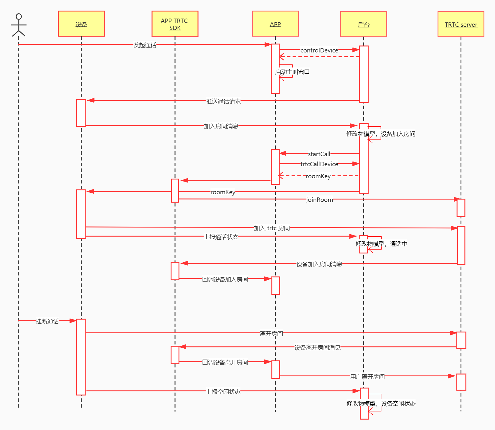
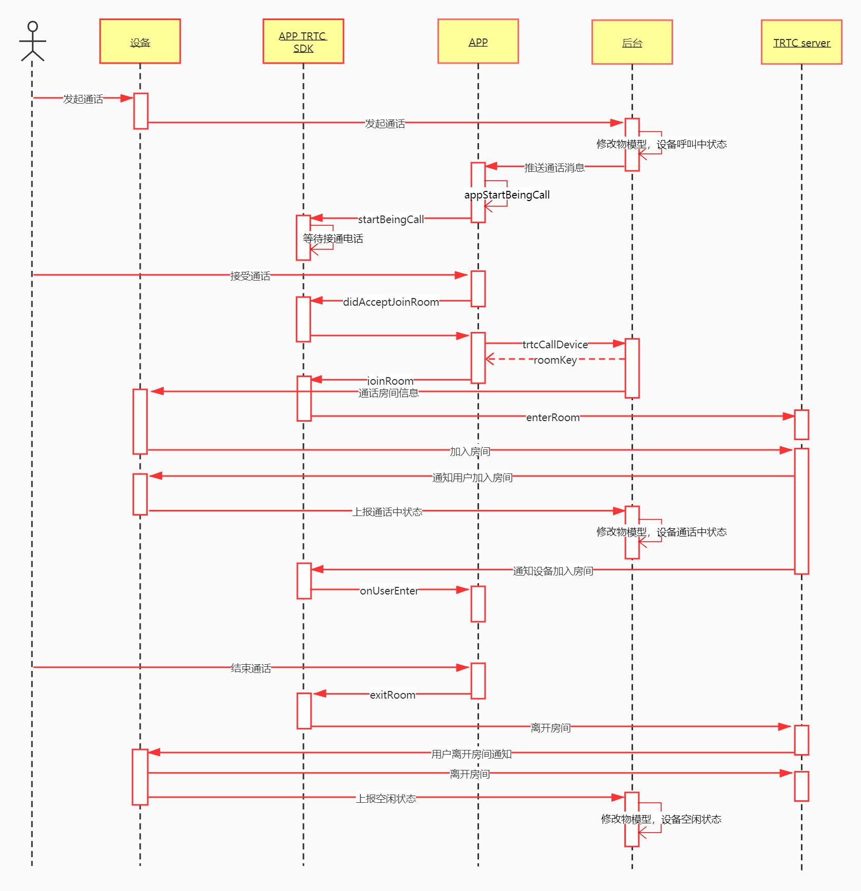

## 概述
当用户接入物联网开发中心服务后，可能会有手表设备与App通话的需求，本文档将介绍Android客户端如何接入实时音视频（Tencent RTC）服务。

## Android 接入流程

1、在 App module下的build.gradle中添加依赖项

```
implementation 'com.tencent.iot.explorer:explorer-link-android:x.x.x'
implementation 'com.tencent.iot.explorer:explorer-link-rtc:x.x.x'
```
具体版本号可参考 [explorer-link-rtc](https://cloud.tencent.com/document/product/1081/50893)  [explorer-link-android](https://cloud.tencent.com/document/product/1081/47787)

2、基于SDK接入

##### App主动呼叫

```
/* 唤起主动呼叫页面 */
TRTCAudioCallActivity.startCallSomeone(Context context, RoomKey roomKey, String beingCallUserId) //音频呼叫 context: 上下文，roomKey: 房间相关参数，beingCallUserId: 被呼叫方的id
TRTCVideoCallActivity.startCallSomeone(Context context, RoomKey roomKey, String beingCallUserId) //视频呼叫 context: 上下文，roomKey: 房间相关参数，beingCallUserId: 被呼叫方的id
```


```
/* 收到websocket消息后获取房间信息并进入房间 */
IoTAuth.deviceImpl.trtcCallDevice() //获取房间信息
TRTCUIManager.getInstance().joinRoom(Integer callingType, String deviceId, RoomKey roomKey) //进入房间 callingType: 呼叫类型，deviceId: 设备ID，roomKey: 房间相关参数
```

具体可参考[sdkdemo](https://github.com/tencentyun/iot-link-android/blob/master/sdkdemo/src/main/java/com/tencent/iot/explorer/link/core/demo/App.kt)

##### App被动呼叫

当App收到TRTC设备状态更新的websocket消息或者信鸽推送时，可以出发App被动呼叫逻辑

```
TRTCUIManager.getInstance().setSessionManager(TRTCSdkDemoSessionManager()) //其中TRTCSdkDemoSessionManager需要自己实现(继承TRTCSessionManager)
TRTCVideoCallActivity.startBeingCall(Context context, RoomKey roomKey, String beingCallUserId) //音频呼叫 context: 上下文，roomKey: 房间相关参数，beingCallUserId: 被呼叫方的id
```

* 首页轮询TRTC设备状态查看App是否被呼叫
可参考app module下的[requestDeviceList](https://github.com/tencentyun/iot-link-android/blob/master/app/src/main/java/com/tencent/iot/explorer/link/App.kt)接口

## 通话流程梳理
##### 连连 APP 呼叫设备端

时序图：



##### 设备端呼叫连连 APP 

时序图：

